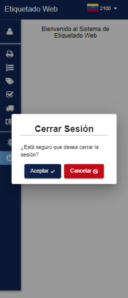

# Farmatodo - Etiquetado Web

Migración Frontend de Farmatodo Etiquetado Web de Kendo UI a Angular Material v11 

  

## Descripción (Description)

Después de recibir las indicaciones concernientes al proyecto del Aplicativo de Etiquetado Web, y revisando tanto la web como el código fuente del presente proyecto, se listaron una serie de tareas prioritarias y netamente requeridas centradas en la migración de Kendo UI a Angular Material.
		
Además, se habían identificado una serie de mejoras sugeridas que podrán ser implementadas posteriormente en otro lapso de tiempo o sprint, en pro de la refactorización del código y revindicar con los estándares que sean venido adoptando en la migración del Portal de Aplicaciones Corporativas (PAC).

## Caracteristicas (Features)

Inicio de Sesión (Login)

Home con Sidebar

Dialogs y SnackBar

Perfil de Usuario (Profile)

Tablas de Material MatTable

Etiquetado Express

Investigador de ítems

- Producto                          
-  Cálculo máximo              
- Planogramas
- Exhibiciones adicionales 
- Calendario de pedidos
- Engordes
- Transferencias                
- Movimiento de inventario 
- Históricos de Máximos
- Pedidos                           
- Distribuciones

Loader animación de carga HTTP

## Refactorización (Refactoring)

Se debe destacar que se realizaron algunas mejoras sugeridas que fueron muy necesarias en el marco de proyecto.
- Interceptor de Peticiones HTTP
- Mapeo de Models, Requests, Responses
- Finalizar subscriptores de Observables
- Respetar el Tipado Estricto de TypeScript

## Herramientas (Tools) 🛠️

Las herramientas utilizadas en el desarrollo del proyecto fueron:

* [Node JS v14 o superior](https://nodejs.org/es/) - Entorno de Ejecución de Servidor para JavaScript

* [Angular v13](https://angular.io/) - Framework Web Frontend para crear SPA (Single Page Aplication).
 
* [Angular Material v13](https://material.angular.io/) - Framework CSS basado en Material Desing para el diseño de interfaz web modernas.

### Equipo (Team) ✒️

A continuación se menciona a todos aquellos que participaron en el proyecto:

* **Jhon Pereira** - *Lider Técnico* - [Linkedin: @jhon-pereira-91750137](https://www.linkedin.com/in/jhon-pereira-91750137)
  
* **Carlos Rodríguez** - *Consultor Técnico*

* **Ramón González** - *Desarrollador Web*

* **Luis Achique** - *Desarrollador Web Frontend* - [GitHub: @achique-luisdan](https://github.com/achique-luisdan))

## Reseñas (Reviews)
<section align="center">

<a href="https://www.linkedin.com/in/jhon-pereira-91750137"><b>Jhon C. Pereira C.</b></a>

<b>Especialista de Proyectos TI</b>

<b>Farmatodo</b>

</section>	
El proyecto de Migración de la aplicación de Etiquetado: Kendo UI a Angular Material UI, Luis aporto todo su dominio para migrar los elementos propios de Kendo UI a angular Material UI, asi como agregar interceptores centralizado para el manejo de errores y mensaje de exito de la capa de API servicios rest, asi como ajustar a las mejores practicas en el uso de Typescript. Recomiendo a Luis en desarrollo de front end con Angular 11.
