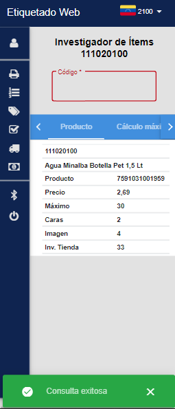

# Farmatodo - Etiquetado Web

Migración Frontend de Farmatodo Etiquetado Web de Kendo UI a Angular Material v11 

  

## Descripción (Description)

Después de recibir las indicaciones concernientes al proyecto del Aplicativo de Etiquetado Web, y revisando tanto la web como el código fuente del presente proyecto, se listaron una serie de tareas prioritarias y netamente requeridas centradas en la migración de Kendo UI a Angular Material.
		
Además, se habían identificado una serie de mejoras sugeridas que podrán ser implementadas posteriormente en otro lapso de tiempo o sprint, en pro de la refactorización del código y revindicar con los estándares que sean venido adoptando en la migración del Portal de Aplicaciones Corporativas (PAC).

## Caracteristicas (Features)

Inicio de Sesión (Login)

Home con Sidebar

Dialogs y SnackBar

Perfil de Usuario (Profile)

Tablas de Material MatTable

Etiquetado Express

Investigador de ítems

- Producto                          
-  Cálculo máximo              
- Planogramas
- Exhibiciones adicionales 
- Calendario de pedidos
- Engordes
- Transferencias                
- Movimiento de inventario 
- Históricos de Máximos
- Pedidos                           
- Distribuciones

Loader animación de carga HTTP

## Refactorización (Refactoring)

Se debe destacar que se realizaron algunas mejoras sugeridas que fueron muy necesarias en el marco de proyecto.
Interceptor de Peticiones HTTP

- Mapeo de Models, Requests, Responses
- Finalizar subscriptores de Observables
- Respetar el Tipado Estricto de TypeScript
